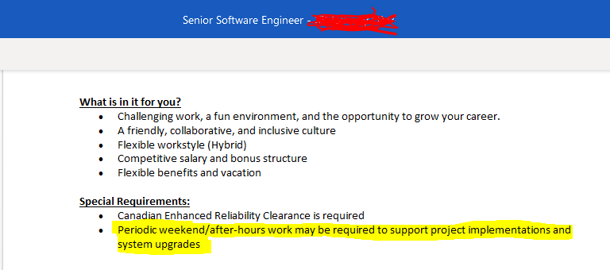

import EmployeeHopesSvg from './employees-hopes-McKinsey.svg';
import Link from '@docusaurus/Link';

I was recently proposed a position as a Senior Software Engineer. Whether I'll get the job or not, I want to talk to you about something that never smells good: after-hours work. This is not for a startup or a product that rarely gets deployed; I'm talking about a multibillion company that will need to deploy countless times in the future. This primitive, obsolete, and outdated approach is how many companies still operate: waiting until nobody can use our platform/service, then deploying it manually.

<!-- truncate -->

## Why after-hour deployments are bad?

For two main reasons:
- [Repulsive for the best candidates](#repulsive-for-the-best-candidates)
- [Recurring fees](#recurring-fees)

### Repulsive for the best candidates

After the Covid-19 pandemic, [people have more expectation about their working conditions](https://insights-north-america.aon.com/enhancing-wellbeing/changing-expectations-how-the-pandemic-has-affected-what-employees-want-from-their-benefits-programs). For example, [51% of people are hoping for a better work-life balance](https://www.weforum.org/agenda/2021/05/employers-pandemic-covid-19-mental-health/). And they should be: it is the reasonable reality to expect given what technology permits in 2023.

<Link to="https://www.mckinsey.com/capabilities/people-and-organizational-performance/our-insights/what-employees-are-saying-about-the-future-of-remote-work">
    <EmployeeHopesSvg />
</Link>

I’m sure, as a responsible employer, that you are always searching for ways to improve the work-life balance of your employees, which, in turn, will give you the opportunity to attract the most competent candidates. However, all these efforts from your organization can be thrown out the window if you ask for your employees to do overtime time and time again. Manual deployment is a mentally taxing task for your employees - it drains mental energy without any real contribution to expertise.

You’ll never be able to recruit A-grade employees that way. And if A grade employees avoid your organization, guess what? B-level employees that are looking to improve themselves will lack the guidance they need. What does employees do when they lose their momentum forward? They start looking elsewhere. So you’ll be left with barely average C-grade employees.

### Recurring Fees

Let’s say you need 3 hours of work, every month, with 8 people in the team, to deploy outside of operation hours, with a mean hourly cost of $60 x 1.5 = $80 an hour as it’s overtime.

$80 x 3 hours × 8 employees x 12 deployments/year = $23,000/year.

Now let’s say you have 10 teams that are deploying like that, costs really adds up…

Of course, for some specific situation (POC, MVP, deployments 1–2 times a year, etc.), automated deployment doesn’t make sense. For the rest of the projects, the cost of not doing it is far more important.

Moreover, the more tasks the project requires, the more people you’ll need. With the labor shortage, do you really think it’s a good idea?

## What are the advantages of live automated deployments?

1. 🤑 Avoiding paying overtime
2. 🙌 Team spirit up: you’ll have a big relief from your employees. Yes, they make more money with overtime, but do you think they really like that? 
3. 😎 You’ll be able to attract and retain the best candidates as they will be able to work at the level or their competence.
4. 👌 Ability to roll back to the previous version in a snap if anything goes wrong.
5. 💨 Faster deployments mean your team can ship new features quicker
6. 🙏 More reliable deployments, as the critical human error will be out of the equation
7. ⏰ As your deployment is not impacting availability, you can stay up 24/7

Automated deployments are one of the pillars of [DevOps](https://en.wikipedia.org/wiki/DevOps). If you can’t deploy automatically, you can’t pretend you’re a DevOps team.

## How to get started?

To deploy live, you’ll need some expertise for the deployment techniques below:

- A [*Blue-Green* deployment](https://docs.aws.amazon.com/whitepapers/latest/overview-deployment-options/bluegreen-deployments.html) is one deployment where you deploy the new version, without any pressure, on a duplicated infrastructure. You have all the time you need to, because guess what? It has zero impact on the real production yet. You can then run all the tests you need directly on the production code. As it is the exact same infrastructure that will be used in production, the replication will me perfect, so you’ll avoid the "it works on my machine" situation. When your tests are done, you just have to redirect your traffic - via a [proxy server](https://en.wikipedia.org/wiki/Proxy_server) - to the new infrastructure. As this step takes literally a few milliseconds, it can be done live without service downtime.

- A [*Canari* deployment](https://cloud.google.com/deploy/docs/deployment-strategies/canary) is a even more evolved technique where you release your new production for a subset of your user base - it can be 1%, 5%, 10%, 25%, whatever you want. Basically, you’re testing the new version from a user standpoint before rolling it out to all users.

Both methods give you the possibility to deploy during operation hours. It you’re new to this, I suggest you start with Blue-Green, as it is easier to implement.

This is a big cultural shift, yes. But I suggest you calculate the upside of it. How many deployments a year you’re doing? How much does it cost you in overtime work?