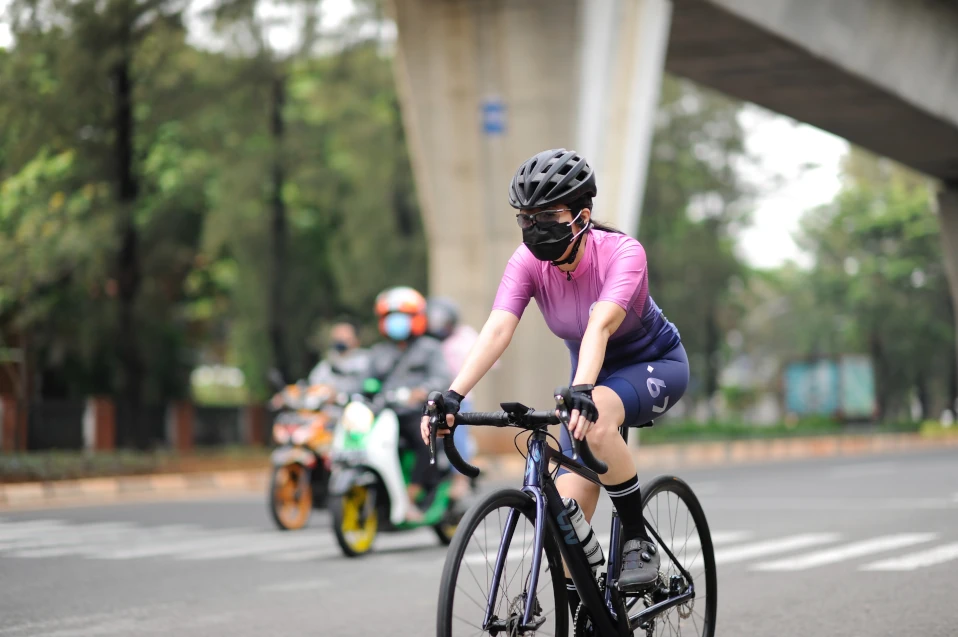
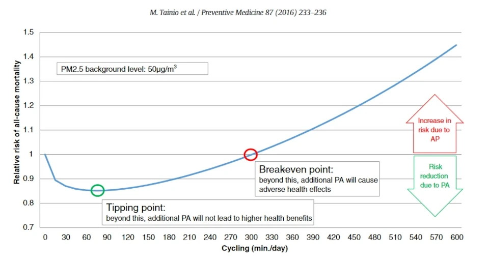
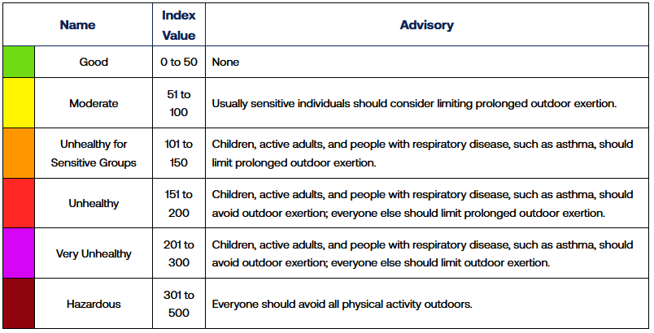
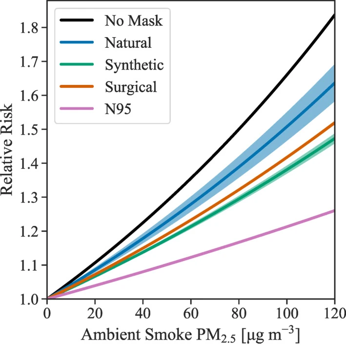
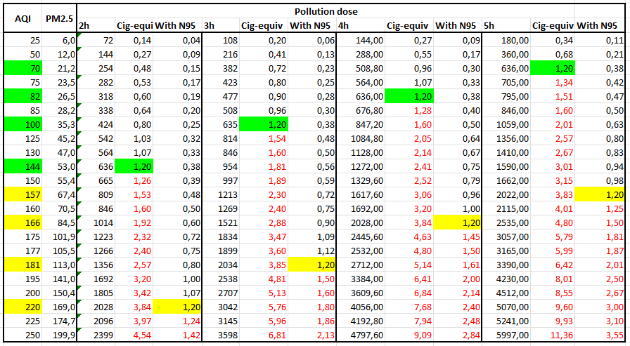
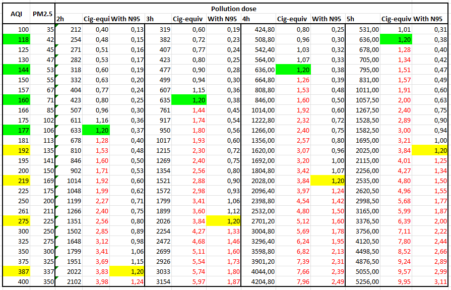
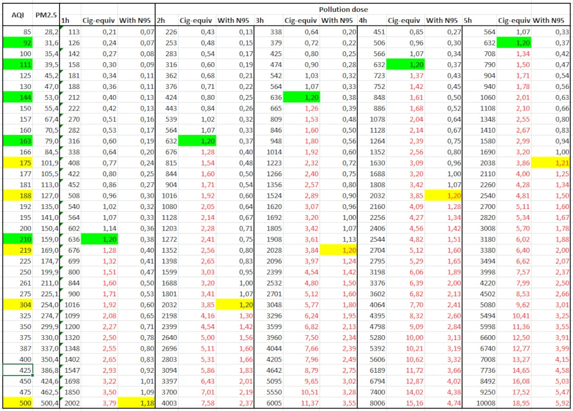
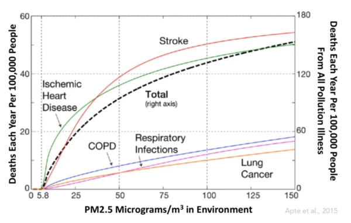

import Youtube from '@site/src/components/media/Youtube';

Summer 2023, wildfires are terrible in Canada. Air quality deteriorates: [Montreal becomes temporarily the worst city in the world for air quality](https://www.journaldemontreal.com/2023/06/25/montreal-la-plus-polluee-au-monde). This is the most direct effect of climate change so far. It is in our face.

With the effects of global warming increasing every year, I suspected it marked a turning point. In the future, we won't enjoy the constant freedom of breathing in fresh air whenever we step outside. We'll have to pick the moments, like during Canadian winters when snowstorms hit: we'll need to stay indoors, close windows, and wait for conditions to improve. Or do we?

This is when I began searching for a specific and detailed model of what to do for different outdoor air pollution levels. Unfortunately, all the advice I found was binary "Exercise is ok in the orange zone (100-150) but not ok in the red zone (150-200)" or was extremely vague "You can wear a N95 mask, but don't stay outdoors too much". I wanted to know: could I still train outdoors? Could I exercise if I wear a N95 mask? Should I minimize my exposure time? For how much, *exactly*?

Here I try to answer that question, as I believe I can contribute with my analysis.

:::caution

There's a lot of assumptions in that model - explained the best I could - but it's still far from being perfect.

I am by no means a medical professional. Don't ask me for medical advice: I won't answer you. I just like to aggregate data the best I can for myself, and share it with others.

This model was built to be as generic as possible, but I used my context as the baseline - your context may differ.

:::

## Model context

For building the present model, I considered only the PM2.5 pollution level in the air. This is the type of pollution mostly affected by wildfire & the metric that almost always dictates the air quality where I live here in Montreal. Know that there's a lot more (PM10, O3, no2, etc.).

This model is targeted for athletes. That means two things:
- Athletes are already doing 10+ hours of intense physical activity per week. Skipping a day (or even a week) of training won't decrease the global, long-term health benefits they get from exercising. When the air is polluted, day-to-day outside exercising then becomes an all risk, no benefit scenario, as the health gains are already mostly maximized.
- The increased PM2.5 exposition from increased breathing need to be taken in consideration. When you're just walking of traveling by bike, your breathing rate doesn't increase much. However, when you're doing proper training, it will increase much more.

### Health benefits from exercising

If you're not doing enough physical exercising to maximize the health benefits, this model will probably be too cautious for you, as it doesn't account for the health gains you'd benefit from more exercise. For example, [a health gain for active transportation via cycling is present up to 5h a day at PM2.5 of 50 (AQI of 137)](https://www.sciencedirect.com/science/article/pii/S0091743516000402?ref=pdf_download&fr=RR-2&rr=80d4753cb8daca53).

[Even in the most polluted cities in the world, it's healthier to exercise outside than it is to not exercise at all](https://www.sciencedirect.com/science/article/pii/S2095254620301277#fig0002):

> Even with a reasonably high PM2.5 concentration level (e.g., ∼180 µg/m3), it would still be safe for the majority of people, except for those aged 60 years and older or with existing chronic conditions, to engage in MPA outside for at least 2.5h per week.

180µm/m3 (AQI level: 230) is considered a super high level here in Montreal. It is basically the peak level when Montreal reached the most polluted city last summer (239). And even at that point, it's healthier to exercise 2.5h per week outside then to not exercise.

I fear that the advice "don't exercise outside today" will be misleading the majority of the population. Non-athletes need to understand that they still benefit from a dog walk or a bicycle commute outside.

You don't believe me? Know that having an athlete level "elite" VO2max - the maximum level of oxygen consumption - is associated with a 5-fold reduction in all cause mortality, which is more than smoking. And smoking is much more harmful to you than any level of pollution.

<Youtube
    id="ovM3mD5Roow"
    start="306"
    title="Peter Attia comments the reduction in all cause mortality rate with increased vo2max"
/>

So if you never exercise right now, tackle that habit first. You'll be able to optimize your pollution level later.

### Breathing rate

[Breathing rate has been studied to be proportional with oxygen consumption](https://www.semanticscholar.org/paper/VE-response-to-VCO2-during-exercise-is-unaffected-Itoh-Fukuoka/7d67cc9c5c91433f251d30ecfbb84c78f6287f8e). Exposition to pollution is also proportional with exposition time outside.

Personally, my average power for a proper cycling workout is around 210 watts. 

Using the [Zwift hack MAP and FTP Calculator](https://zwifthacks.com/app/map-ftp-calculator/), I figured a power of 210 watts is approximately 45 ml/kg/min VO2 - 60% of my estimated VO2max. [Breathing rate can increase by a factor of 5 during exercise](https://www.trainingpeaks.com/coach-blog/training-through-bad-air-quality/), so I estimated a proportional breathing rate: 60% * 5 = 3.

That means that 1 hour of a proper cycling workout outside is the equivalent of being outside for 3 hours.

For running, I used a breathing increased rate of 4 as [VO2 (oxygen demand) is measured to be ≈30% higher for running then cycling for the same energy expenditure](https://www.ncbi.nlm.nih.gov/pmc/articles/PMC1334197/).

## Finding acceptable baseline

What does acceptable risk means?

We need a risk baseline, or an acceptable outside air pollution level. The general consensus if that [healthy individual should start taking precautions over an Air Quality Index of 100](https://www.lung.org/clean-air/outdoors/air-quality-index), or a [PM2.5 concentration of 35µm/m3](https://www.trainingpeaks.com/coach-blog/training-through-bad-air-quality/).

I also found the [AQI to Cigarettes Calculator](https://jasminedevv.github.io/AQI2cigarettes/) from [Jasmine Webb](https://medium.com/@jasminedevv). There, I learned that a [24h exposition of a 22µm/m3 PM2.5 concentration roughly translates to the health effects of smoking a cigarette](https://berkeleyearth.org/air-pollution-and-cigarette-equivalence/). I'll use this metric because I think it's much more understandable for me and most people.

If we divide the "safe" pollution level of 35µm/m3 by 22µm/m3, we get a maximum daily cigarette dose of 1.6. That's gonna be the acceptable baseline. At 1.6 cigarettes or more, I'll be looking to reduce pollution exposition.

As it's a maximum *daily* exposition, we need to subtract the pollution dose that will occur outside of training.

Advice here, to lower that amount, that day:
- Avoid cooking - it is [the most common PM2.5 source at home](https://www.ncbi.nlm.nih.gov/pmc/articles/PMC9434053/). Even if you use a fan to exhaust cooking fumes outside, the risk is still to create a low-pressure zone in your house, which will make your home suck the bad air from outside.
- Use a good, powerful enough air filter. The air filter level should be increased with ambient pollution - if AQI level is high, put it at high.

If you follow this advice, I hypothesize that the level of PM2.5 exposure will be pretty low.

To calculate how much to subtract, I used the [average outside PM2.5 concentration for the past year in Montreal](https://aqicn.org/data-platform/register/) - 8.3µm/m3. That number divided by 22 get us an "ambiant" dose to subtract. I could have subtracted the time from training - let’s say multiply this dose by 19/24 for a 5-hour training. However, I don't know if it's possible to get a PM2.5 level that low during a pollution wave, even with the use of an air filter. I guess I will have to buy myself a PM2.5 monitor to confirm.

Let's carry on. The acceptable pollution dose from training should be no more than 1.6 - (8.3/22) = **1.2 cigarettes**.

## The efficiency of masks for air pollution

Masks (even N95) aren't perfect. N95 are certified to 95% for particulates as small as 0.3 micron. Yes, they will protect you significantly, but they may still make you breathe even smaller particulates. I'm sure these particulates exist, it would be naïve to think the opposite. That's why my intuition tells me we should look deeper for the effectiveness of masks for such scenarios.

I found out that [N95 masks lower the pollution exposure to a factor of 14, and lower the hospitalization risk by a factor of ≈3.2](https://www.ncbi.nlm.nih.gov/pmc/articles/PMC8438762/). The latter result seems to be more relevant to us. As I suspected, they are not perfect, as the risk is still increasing with pollution rates. The curve is just less pronounced. 

For the current model, I will use a 3.2x dose reduction ratio to estimate the effect of wearing a N95 mask.

## Sport specific AQI limits

Because every sport has its own context, we need to estimate limits for each.

### 🚴‍♂️ Road cycling

For road cycling, pollution from cars has to be taken into consideration. Training on a high-traffic road [**doubles the amount of PM2.5 exposition from ambient levels**](https://www.wunderground.com/cat6/air-pollution-cars-affects-everyone-why-we-should-care).

This is the scenario most likely occurring if you exercise on the road, with a lot of traffic. This is a worst-case estimation as it's rare that 100% of training time will be in a very traffic dense area (if you do, I feel sorry for you).

For road cycling on a high-traffic road, the AQI Index limits would be
- 144 for a 2-hour ride / 220 with N95
- 99 for a 3-hour ride / 181 with N95
- 81 for a 4-hour ride / 166 with N95
- 70 for a 5-hour ride / 157 with N95

### 🚵 Nature cycling (Gravel/MTB/CX)

Here we assume we are away from any close source of pollution (cars, factory, etc.)

AQI Index limits:
- 177 for a 2-hour ride / 387 with N95
- 160 for a 3-hour ride / 275 with N95
- 144 for a 4-hour ride / 219 with N95
- 118 for a 5-hour ride / 192 with N95

### 🏃‍♂️ Running

We consider that running is done away from pollution, in a low-traffic area.

Running limits can be considered for other sports like soccer, but also for less intense activity like hiking or walking. AQI limits would be higher for these, so if you're safe to run, you'll be safe to walk or hike.

AQI Index limits:
- 316 for 30 minutes running / No restriction with N95
- 208 for 1h running / 500 with N95
- 163 for 2h running / 304 with N95
- 143 for 3h running / 219 with N95
- 111 for 4h running / 188 with N95
- 92 for 5h running / 174 with N95

## Dashboard

Let's say we have an AQI of 166. Here's what an advice dashboard may look like:

| Time    | 🛣️🚴‍♂️  | 🚵    | 🏃‍♂️ |
|---------|--------|-------|----|
| 0.5h    | 🟢     | 🟢   | 🟢 |
| 1h      | 🟢     | 🟢   | 🟢 |
| 2h      | 😷     | 🟢   | 😷 |
| 3h      | 😷     | 😷   | 😷 |
| 4h      | 😷     | 😷   | 😷 |
| 5h      | 🚫     | 😷   | 😷 |
| 6h      | 🚫     | 😷   | 😷 |

I'm planning to implement this dashboard on my [weather report app](https://brunopc-net.github.io/Horus/), so stay tuned!

## What about intensity?

The fact is that intensity will increase your breathing rate, but it's not the most important factor. Take running: at worst, it will worsen your dose by 25% (the current model is already considering you will be at 80% breathing rate). Time is much more important here: in fact, the more it's polluted outside, the more you should considerate shorten your workout and make it count by going more intense. Let's say you choose to do a quick, 20 minutes all-out effort: your pollution dose will be equivalent to someone doing a 25 minutes moderate run.

Moreover, [higher exercise intensity may even be less harmful than low intensity](https://www.washingtonpost.com/wellness/2023/06/07/exercise-outdoors-air-quality-wildfire-smoke/):

> Surprisingly, “there is some evidence that shorter high-intensity exercise bouts are less harmful than longer low-intensity ones,” Hull said.
>
> For a 2014 study, Koehle and his colleagues tested the lung function of cyclists while they alternately rode slowly or intensely in polluted air. Unexpectedly, the riders experienced more difficulties breathing while riding gently than when they pedaled all-out.
>
> The reasons are not altogether clear, but the practical implications are, Koehle said. If smoke hangs in the air, keep your workouts short and sharp, rather than long and slow. The fitness benefits will be about the same, but your “air-pollution exposure” will be much less, he said.

## Outro

Whatever the air quality is (within the AQI model), there's some physical activity you can do outside without catching a massive pollution dose. Even with a 500 AQI, there's the possibility for a 60 minutes run with a N95 mask. From what I see, while air quality is a serious concern for the following decades, it's pretty manageable with simple adaptations, even for serious athletes.

That being said, there's another factor in air-related health problems: inside air. This is the thing with air pollution as I understand it: it's like radiation, in the sense that it depends on the total dose received. Wherever you go, the localized pollution will add up to your total exposition. [The World Health Organization (WHO) updated its air quality guidelines in September 2021](https://smartairfilters.com/en/blog/who-updates-air-quality-pollution-guidelines/): the annual average shouldn't be over 5µm/m3 to prevent most pollution-related problems.

As I wrote this article, the trailing year average for Montreal (2023-09-26 to 2023-09-25) is 8.3. Not much over the limit, you'd say. However, as it's an annual average, a tiny change can affect a lot on the total dose received. Reducing from 8.3µm/m3 to 5µm/m3 would be like a reduction of 55 cigarettes a year. That's also the equivalent of 46 training doses occurring in a polluted area from the current model. I'm not an expert, but it seems to be a significant amount to me.

Moreover, and counterintuitively, [the smaller the concentration, the higher the impact of a pollution reduction is](https://smartairfilters.com/en/blog/low-levels-of-air-pollution-actually-cause-most-harm/). In other words, a reduction from 10 to 5µm/m3 will have more positive effects than a reduction from 100 to 95µm/m3.

It looks like reducing the average indoor PM2.5 concentration from 8.3µm/m3 to 5µm/m3 will have even a bigger impact than 46 training doses within the current advice model. I already have a powerful air filter, but this analysis has convinced me to buy an air quality monitor for my home.

Take care of your air, year-long.

If any of my assumption, source, or deduction is wrong, I'd be pleased if you share that to me, as I'm eager to develop my knowledge on the topic.

[Spreadsheet for AQI limits](https://docs.google.com/spreadsheets/d/1XMMKUA4npwtAi0dGAHJT3UPaFEC5SNRHFRRq_MFdwqo)

Thumbnail image from [Nasirun Khan](https://www.pexels.com/@nasirun-khan-102497153/)